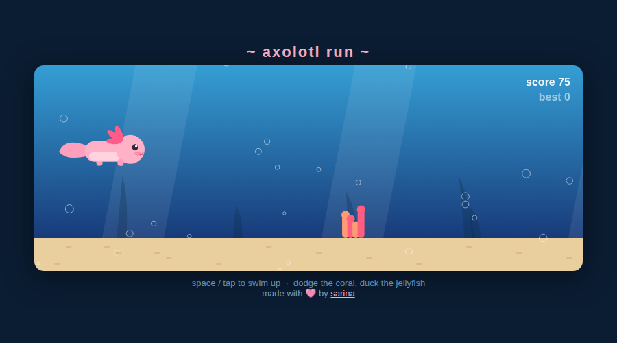

# 🌊 Axolotl Run

An endless runner starring a very determined axolotl. Dodge the coral, duck the jellyfish, don't get swept away.

**▶ [Play it here](https://sarinadfernandez-create.github.io/axolotl-run/)**

## How to play

- **Space** / **↑** / **tap** — swim up
- Coral grows on the seafloor: jump it
- Jellyfish drift at head height (they show up once you're good): stay low
- The current speeds up the longer you survive

## Nerd notes

Single self-contained `index.html` — no dependencies, no build step, just canvas and `requestAnimationFrame`. The water slowly shifts color the longer you play. Fork it, reskin the axolotl, go wild.

Made with 🩷 by [sarina](https://github.com/sarinadfernandez-create)
